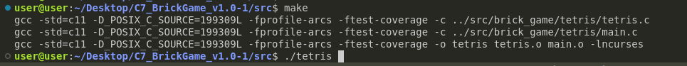
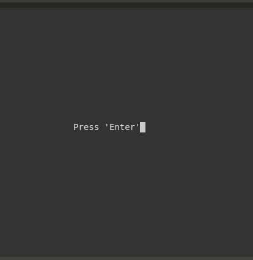
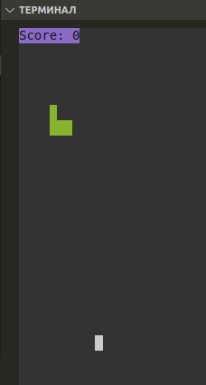
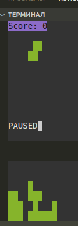
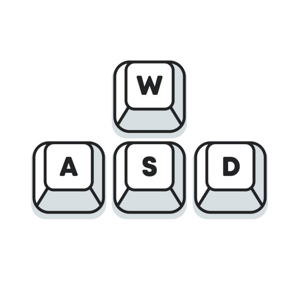

## Part 1. Игра "ТЕТРИС" на СИ

### 1.1. Compiling the game

1) After downloading the game, you need to go to the directory `../src/` where `Makefile` is located
2) To compile the game, you need to run the command `make`
3) Run the command `./tetris`
4) The game is launched

### 1.2. Start of the game

 1) Press `Enter`

 2) The game has begun

### 1.3. Pause and end the game

 1) When you press the `p` button, the game goes into pause mode

 2) Pressing the `q` button ends the game.

### 1.4. Managing figures.

- To flip the figure, press the `w` button.
- To speed up the figure's fall, press the `s` button.
- To move the figure to the left, press the `a` button.
- To move the figure to the right, press the `f` button.

### 1.5. Clearing a directory of files.

 1) Run the `make clean` command.
