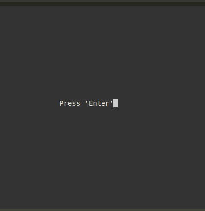

## Part 1. Game "TETRIS" in C

### 1.1. Компиляция игры

1) После скаивания иры необходимо пройти в директорию `../src/` где нахоодится `Makefile`
2) Для компеляции игры необходимо выполнить команду `make`
3) Выполните команду `./tetris`
4) Игра запущена

### 1.2. Старт игры

 1) Нажмите на `Enter`

 2) Игра началась

### 1.3. Пауза и завершение игры

 1) При нажатии на кнопку `p` игра переходит в режим паузы

 2) При нажати на кнопку `q` завершается игра.

### 1.4. Управление фигурами.

# Для переворота фигуры необходимо нажать на кнорпу `w`.
# Для ускорения падения фигуры необходимо нажать на кнопку `s`.
# Для смещения фигуры в лево нужно нажать кнопку `a`.
# Для смещения фигуры в право нужно нажать кнопку `f`.

### 1.5. Отчищение директории от файлов.

 1) Выполните команду `make clean`.